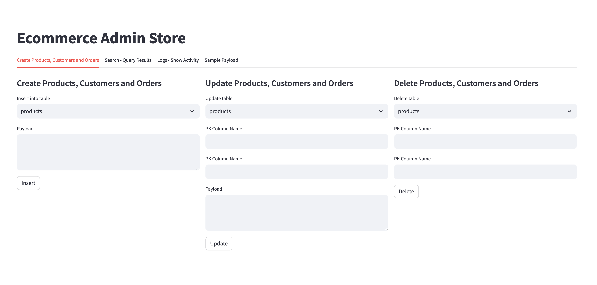

# What is this project about

This project combines code from Streamlit, a generic database library, and a REST API that exposes the database library.

## Which scripts are important

### Standalone App
```
python3 app_main.py ~/_tmp/db/amazon.db
```

### Web App

```
python3 app_web.py ~/_tmp/db/amazon.db
```

#### REST API endpoint 

##### Create
POST http://localhost/api/insert/{tablename}

```
{"customer_id":"1","name":"John","age":25}
```

##### Update
PUT http://localhost/api/update/{tablename}/{pk}/2

```
{

    "age": 30
}
```


##### Search
GET http://localhost/api/search/{tablename}

##### Delete
DELETE http://localhost/api/delete/{tablename}/{pk}/2


### Streamlit App
Note: This need webserver up and running
```
streamlit run app_streamlit.py
```

#### Screen Snapshots 


